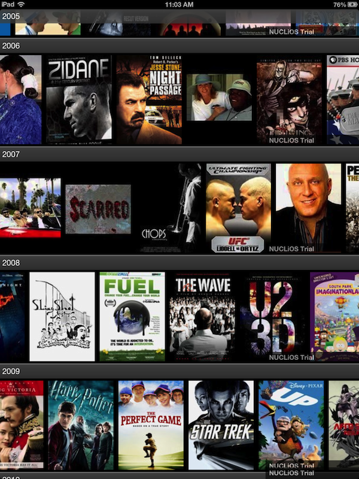
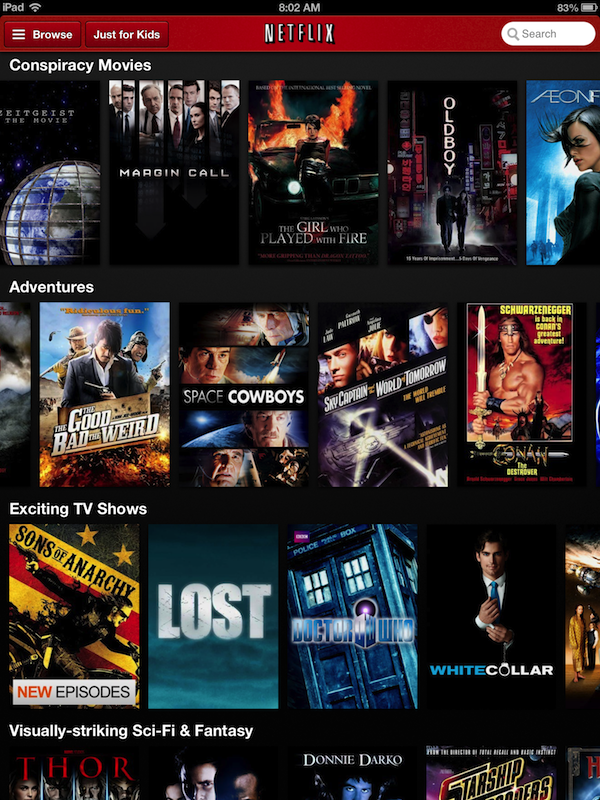

Nuclios.Netflix
===============
A Xamarin.iOS version of the XCode-based sample "Creating a Netflix style iOS Grid" from [SteveZ's post](http://www.infragistics.com/community/blogs/stevez/archive/2012/11/13/creating-a-netflix-style-ios-grid.aspx)

//TODO: Hightlight main differences when ***translating*** the Objective-C code to C#

## Netflix UI on iPad ##

